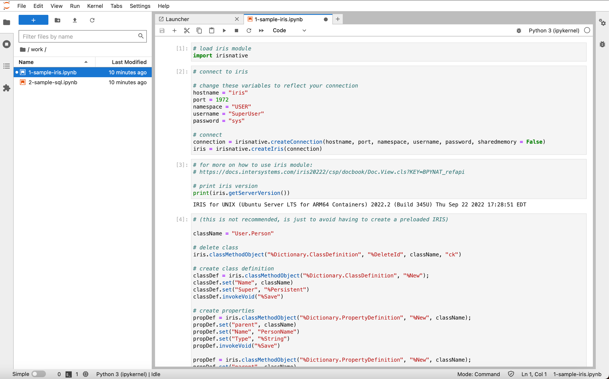

# Jupyter + InterSystems IRIS Module Image

Generates a working image for Jupyter + InterSystems IRIS support
The image comes with some Python modules installed:

- matplotlib
- pandas
- xmltodict
- ipython
- IRIS Python DB-API [documentation](https://docs.intersystems.com/iris20222/csp/docbook/Doc.View.cls?KEY=BTPI_pyapi)

To generate run:

```bash
# change myjpiris:latest to anything you like
docker build . -t myjpiris:latest
```

Your image will be ready to use, simply run:

```bash
# change myjpiris:latest to anything you like (same one used on the previous step)
docker run --name jupyter -p 4200:8888 myjpiris:latest jupyter lab --ip 0.0.0.0 --port 8888 --allow-root
```

- **Access:** [http://localhost:4200](http://localhost:4200)
- **Password:** admin

There are a couple of examples on how to use IRIS within the notebook inside the **work** directory


